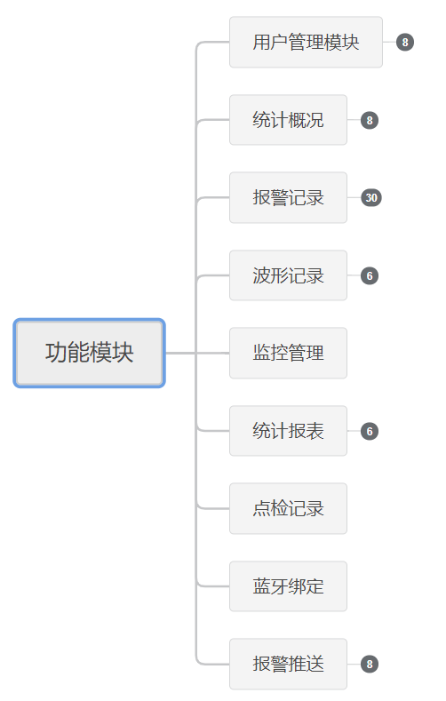
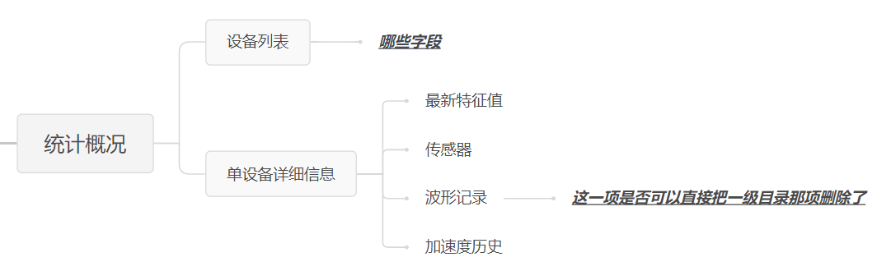
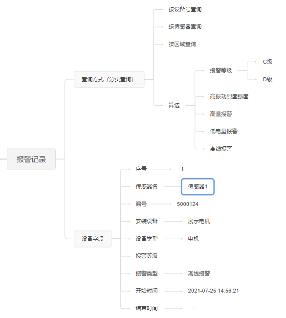
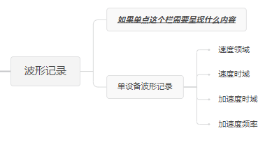
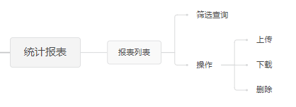
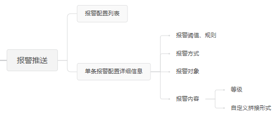

## 前言
### 说明
项目方案需需求方进一步协调沟通，以下只是根据现有信息做出的初步规划

### 项目介绍
本项目用于云平台数据的终端展示与统一管理，采用传统BS架构，套用成熟的项目架构形式和技术选型，初期成果展示会借助小型个人云服务器

## 项目设计方案
### 前端设计 
#### 说明
因为整体是tob项目，前端设计内容要求不高，所以基本以成熟的ui组件库内容拼接即可（elementui）  

#### 子模块
1. 登录模块  
常规项，需要注意的是权限控制，有哪些种类的登录用户，分别拥有怎样的权限？

2. 统计概览  
提供内容信息过少
只能根据界面可分析，需要有
    1. 设备列表   
设备统计量，当前活跃设备量，还有一系列信息的总体列表显示（不可操作，可点击详情）
    1. 单传感器信息显示  
呈现单传感器的各项信息，主要通过后台信息字段，和echarts展示图表信息

1. 报警记录  
多参数分页查询

4. 波形记录 
echarts图表配合内容信息呈现 

5. 监测管理  
vue-echarts
1. 统计报表  
多参数分页查询，提供pdf下载功能，支持删除

7. 点检记录  
暂无信息
8. 蓝牙绑定  
暂无信息
9.  报警推送  
设置报警推送对象，推送方式，推送内容

### 后端设计 
#### 接口设计
#### 软件架构设计
#### 数据库设计

## 系统运行环境
### 浏览器：
包括IE浏览器、chrome浏览器、Firefox浏览器、Safari浏览器；  
### 操作系统：  
windows XP、windows7、windows8、windows10、Linux系统等。  

## 技术选型

### 依赖

- [Mysql] 5.7
- [Jdk] 1.8

### 后端

- [Spring Boot2.3.5.RELEASE](https://spring.io/projects/spring-boot/): Spring Boot是一款开箱即用框架，让我们的Spring应用变的更轻量化、更快的入门。
  在主程序执行main函数就可以运行。你也可以打包你的应用为jar并通过使用java -jar来运行你的Web应用；
- [Mybatis-plus3.3.2](https://mp.baomidou.com/): MyBatis-plus（简称 MP）是一个 MyBatis (opens new window) 的增强工具。
- [flyway5.2.1](https://flywaydb.org/): 主要用于在你的应用版本不断升级的同时，升级你的数据库结构和里面的数据

### 前端

- [npm](https://www.npmjs.com/)：node.js的包管理工具，用于统一管理我们前端项目中需要用到的包、插件、工具、命令等，便于开发和维护。
- [webpack](https://webpack.docschina.org/)：用于现代 JavaScript 应用程序的静态模块打包工具。
- [ES6](https://es6.ruanyifeng.com/)：JavaScript的新版本，ECMAScript6的简称。利用ES6我们可以简化我们的JS代码，同时利用其提供的强大功能来快速实现JS逻辑。
- [vue-cli](https://cli.vuejs.org/)：Vue的脚手架工具，用于自动生成Vue项目的目录及文件。
- [vue-router](https://router.vuejs.org/)： Vue提供的前端路由工具，利用其我们实现页面的路由控制，局部刷新及按需加载，构建单页应用，实现前后端分离。
- [element-ui](https://element.eleme.cn/#/zh-CN)：基于MVVM框架Vue开源出来的一套前端ui组件。
- [avue](https://www.avuejs.com/): 用该组件包裹后可以变成拖拽组件，采用相对于父类绝对定位，用键盘的上下左右也可以控制移动。
- [vue-echarts](https://www.npmjs.com/package/vue-echarts/): vue-echarts是封装后的vue插件，基于 ECharts v4.0.1+ 开发。
- [vue-superslide](https://www.npmjs.com/package/vue-super-slider/): Vue-SuperSlide(Github) 是 SuperSlide 的 Vue 封装版本。
- [vuedraggable](https://github.com/SortableJS/Vue.Draggable/): 是一款基于Sortable.js实现的vue拖拽插件。
- [luckysheet](https://gitee.com/mengshukeji/Luckysheet): Luckysheet ，一款纯前端类似excel的在线表格，功能强大、配置简单、完全开源。

## 规划、阶段、周期

